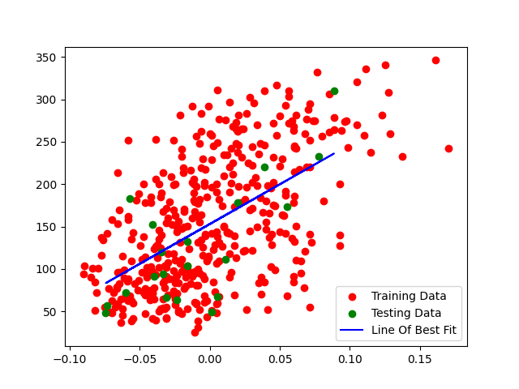

# Linear Regression | Diabetes

A Python supervised ML algorithm using the Sklearn Diabetes dataset to plot the line of best fit.

## Description

This program is an supervised machine learning algorithm that utilises the Diabetes data set from Sklearn and to find the line of best fit using the linear regression equation ``y = mx + b``. The ``m`` and ``b`` values are trained on the labelled data to predict values of ``y``.

The algorithm consists of the following steps:

* The program loads the BMI data from the ``load_diabetes()`` data set.
* The ``x`` and ``y`` data is split into *training* and *testing* sets.
* The ``line_of_best_fit()`` function then trains the data to determine the ``m_value`` and ``b_value`` needed for the formula.
* Determine the line of best fit with formula 𝑦 = 𝑚𝑥 + 𝑏, or ``line = (m_value * x_test) + b_value``
* Scatter plot the training and testing data and plot the line of best fit showing the diabetes disease progression.

## Programming principles

This program employs the programming concepts of algorithms together with functions, data structures, numpy mean and matplotlib.

## Dependencies

* ``import matplotlib.pyplot as plt`` *(for plotting)*
* ``import numpy as np`` *(for arrays and maths functions)*
* ``from sklearn.datasets import load_diabetes`` *(for the diabetes data set)*

## Running the program

Run the ``linearRegression.py`` file in any Python IDE.

## Code preview

```python
# Regression function to return the gradient and intercept of y.
def line_of_best_fit(x_array, y_array):

    # Formula 𝑚 = (μ(𝑥) * μ(𝑦) − μ(𝑥 * 𝑦)) / ((μ(𝑥))2 − μ(𝑥2))
    m = ((np.mean(x_array) * np.mean(y_array)) - np.mean(x_array * y_array)) /  (np.mean(x_array)**2 - np.mean(x_array**2))
    # Formula 𝑏 = μ(𝑦) − 𝑚 * μ(𝑥)
    b = np.mean(y_array) - m * np.mean(x_array)
    return m, b
```

## Graph results



&nbsp;
***  
*An approximate answer to the right problem is worth a good deal more than an exact answer to an approximate problem.* ~ John Tukey
***
&nbsp;

## License

This project is licensed under the GNU GENERAL PUBLIC LICENSE.

## Author

**Megan Bisschoff**

Project submitted for Software Engineering learnership Level 3 Task 21 at [HyperionDev](https://www.hyperiondev.com/)

[View](https://www.hyperiondev.com/portfolio/86596/) submission results.
